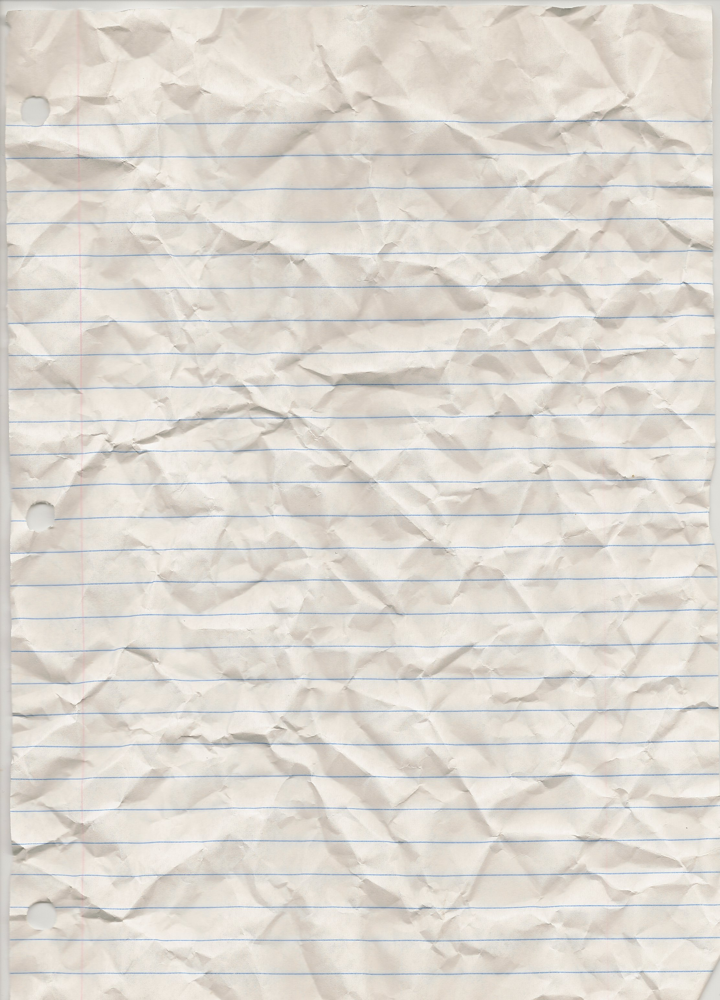
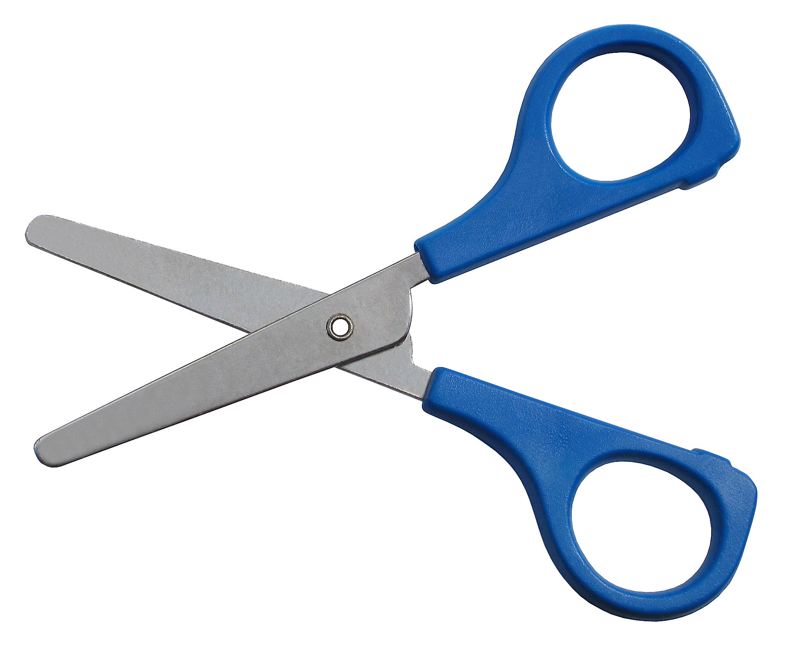

Putting the finishing touches to our game
=========================================

Well done! 

We have now built all the parts of our game that we need to make it work - we just need to combine the various elements.

Let's quickly review each component.

1. Firstly, we built the **structure and layout** of our website using **HTML**. You can review what HTML is and how it works [here](https://github.com/InterfaithCoding/frontend/blob/master/html.md). For more advanced tutorial on HTML I recommend the [W3 Schools HTML Tutorial](http://www.w3schools.com/html/)

2. Secondly, we added some **style** to our website using **CSS**. We made all our images a uniform size, gave them a rounded border and spaced them all evenly along a line. We also added a background to our website and designed how it should look when the player visits our website. You can review what CSS is and how it works [here](https://github.com/InterfaithCoding/frontend/blob/master/css.md). For more advanced tutorial on CSS I recommend the [W3 Schools CSS Tutorial](http://www.w3schools.com/css/)

3. Thirdly, we added some **interactivity** to our website using **JavaScript** and a very useful JavaScript library called **jQuery**. You can review what JavaScript and jQuery are and how it works [here](https://github.com/InterfaithCoding/frontend/blob/master/javascript.md). We wanted to make sure that our player knows that she can click on the images to play the game. Using the event handler, 'mouseenter' and 'mouseleave' (i.e. when the mouse goes over or leaves the images), we updated our CSS rules for the border of the image. When the mouse is not over the images, the border is dotted, but when the mouse is over the images, the border is solid. 

4. Lastly, we built the back-end engine - to make our game functional. For the game we needed three pieces of information: the player's choice, the computer's choice and a comparison between these two choices. We stored the player's choice and the computer's choice as variables - so we can access these values at a later date. We then built a [JavaScript function](http://www.w3schools.com/js/js_functions.asp) to compare these two values and return the outcome of the game to us. 

###So what do we need to do now?

1. The most important thing that we need to do, is to **bind our game logic (i.e. picking the player's choice, the computer's choice and comparing these two values), to the click image event**, so that when our player clicks an image, the comparison between the player's choice and the computer's choice is made and the outcome can be declared. We are going to do this using jQuery.

If you recall, jQuery is tailor made for selecting HTML elements and performing some action on the element(s). So, we need to think about which HTML elements we want to select and what event we want them to respond to.

We want to select any image that is in our list of choices. So let's have a look at our HTML where we have put our images. Did we give them an ID so that we could select them easily?  

```
<ul id='game-images'>
	<li></li>
	<li></li>
	<li></li>
	<li></li>
	<li></li>
</ul>
```
We gave our list the id of 'game-images'. This makes it easy for us to select all the images within that list to apply a certain behaviour to. 

Now let's think about what **event** we want our images to respond to? We want something to happen when they are **clicked**, so we want to respond to the **click** event. 
We would write this in jQuery like so:

```
$('#game-images img').click(function(){
	//here we will write our game code, including picking the computer's choice, the player's choice and the compare function
});
```
It might look a little complex so let's break it down. 

The dollar sign is a **variable**, with the value 'jQuery' stored in it. Everytime we want to use the jQuery library, we need to tell the computer that we want to access it by typing in 'jQuery'. But because we use jQuery so often, it would get tedious to have to write our jQuery before we write each line of code. Instead, we have saved this value as a variable, and we only have to type '$' instead of jQuery each time we want to access the library.

The next part is a reference to the element that we are **selecting**. The hashtag is used to select HTML ids. Within the element with the id game-images, we are selecting anything that is an 'img'. 

We then call the inbuilt jQuery function 'click'.  

It's now time to put it all together. Let's take a look at our final [JavaScript file](https://github.com/InterfaithCoding/pulling-it-all-together/blob/master/rpsls.js)
